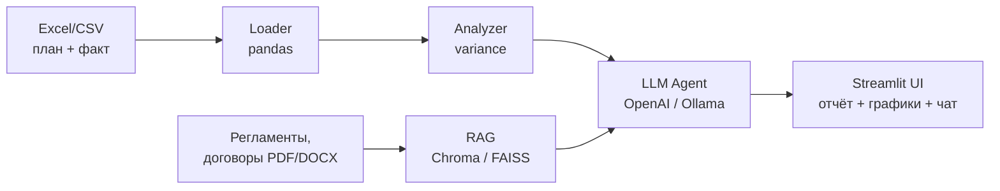
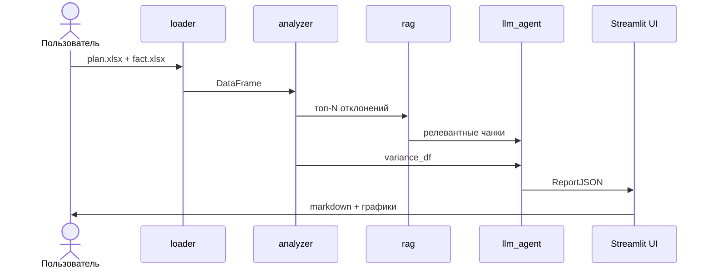

# Design: Архитектура plan-fact-ai-assistant

## 1. Обзор

## 2. Модули

| Модуль | Ответственность | Зависимости |
|---|---|---|
| src/loader.py | загрузка и валидация Excel/CSV | pandas, openpyxl |
| src/analyzer.py | расчёт отклонений | pandas, numpy |
| src/rag.py | индексация и retrieval | langchain, chromadb/faiss |
| src/llm_agent.py | промпты, вызовы LLM | openai, httpx |
| src/charts.py | графики | plotly |
| src/report.py | сборка записки | jinja2 |
| app.py | Streamlit UI | streamlit |

## 3. Поток данных

## 4. Контракты между модулями

- loader.load(...) -> pd.DataFrame
- analyzer.compute(df) -> pd.DataFrame
- rag.retrieve(query, k) -> list[Chunk]
- llm_agent.generate(variance_df, chunks) -> ReportJSON
- report.render(ReportJSON, charts) -> str

## 5. Обработка ошибок

| Слой | Ошибка | Реакция |
|---|---|---|
| loader | битый файл / нет колонок | ValueError |
| analyzer | plan = 0 | rel = None |
| rag | пустой индекс | [] |
| llm_agent | таймаут | fallback-шаблон |
| UI | любая | st.error без сумм |

## 6. Безопасность

- .env не коммитится.
- OpenAI-режим: опциональное маскирование сумм.
- Ollama-режим: данные не покидают контур.
- Логи без сумм и PII.

## 7. Производительность

- DataFrame до 10 000 строк — < 2 сек.
- RAG-индексация — фоновая, кэш на диск.
- LLM-вызовы — стриминг в UI.